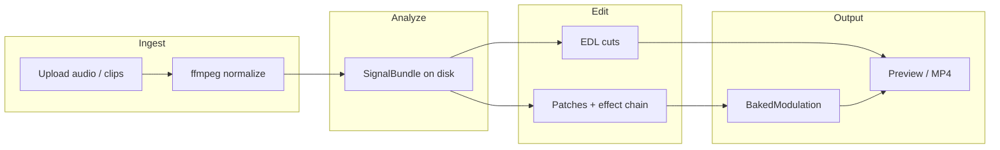

# Aural Reactor — Architecture

This document describes how the **Aural Reactor** music-video tool is structured: major components, data flows, persistence, and where to extend behavior. It complements the high-level README and assumes a single-user, local development setup (FastAPI backend + Vite/React frontend).

---

## 1. Purpose and boundaries

**What the system does**

- Ingests a **song** (audio) and **video clips**.
- Runs **music information retrieval (MIR)** on the audio: beats, downbeats, stems (optional), spectral features, structural sections, drops, and a stable set of **continuous** and **discrete** signals at a fixed control rate (default 100 Hz).
- Builds a **beat-synced edit** (EDL: list of cuts with timeline ranges, clip IDs, and source in-points).
- Lets the user route audio-derived signals to **effect parameters** via a **modulation matrix** (patches with transforms).
- **Previews** in the browser (WebGL) and **exports** a final MP4 via **headless OpenGL (ModernGL)** and **ffmpeg** mux with the mastered audio.

**What stays out of scope (by design)**

- Multi-user auth or cloud sync: projects are JSON files on disk.
- The WebSocket hub currently broadcasts progress and simple events; collaborative editing is not the primary model.

---

## 2. Repository layout

| Area | Role |
|------|------|
| `backend/app/` | Python application: API, analysis, routing, render, WebSocket |
| `frontend/src/` | React UI: timeline, modulation matrix, preview engine, API client |
| `shared/shaders/` | GLSL fragments shared between browser preview and Python ModernGL render |
| `storage/` | Runtime data (not all committed): `media/`, `cache/`, `projects/`, `renders/` |
| `scripts/` | Dev orchestration (e.g. `./scripts/dev.sh`) |

Configuration defaults live in `backend/app/config.py` (`MVM_*` environment variables, optional `.env`).

---

## 3. End-to-end data flow

1. **Upload** → canonical FLAC (audio) and H.264 MP4 (video) under `storage/media/<project_id>/`.
2. **Analyze** → cached `SignalBundle` under `storage/cache/audio/<sha>-stems|mix/`.
3. **Arrange** (optional / repeated) → new EDL; can merge with **locked** cuts and regenerate default routing.
4. **Modulation** → `bake(bundle, patches)` produces per-target float32 time series aligned to `rate_hz`.
5. **Render** → for each output frame: decode clip frame → GL effect chain with uniforms from baked modulation → raw RGB to ffmpeg → mux with project audio.

---

## 4. Backend architecture

### 4.1 Application entry and HTTP surface

`backend/app/main.py` constructs a **FastAPI** app with:

- **CORS** for the Vite dev origin (`localhost:5173`).
- **`/media`** static mount → `settings.media_dir` (served clips and audio URLs the browser plays).
- **REST routers** (all prefixed as below) and a **WebSocket** route.

| Prefix | Module | Responsibility |
|--------|--------|----------------|
| `/api/projects` | `api/projects.py` | CRUD projects, resolution, meter, **authoritative EDL updates**, clip flags |
| `/api/media` | `api/media.py` | Upload audio/clips, thumbnails, motion probe |
| `/api/analyze` | `api/analyze.py` | Run analysis, fetch summary, **binary signal** blobs for UI plots |
| `/api/arrange` | `api/arrange.py` | Beat-synced EDL + optional auto-modulation seed |
| `/api/effects` | `api/effects.py` | Effect metadata (see effects registry) |
| `/api/routing` | `api/routing.py` | Patches, presets, baked modulation for preview/export |
| `/api/render` | `api/render.py` | Export MP4, serve render files |
| `/ws` | `ws/project_ws.py` | Per-project rooms for progress and notifications |

Long-running work (**analyze**, **render**, **arrange**) runs in a thread pool via `asyncio.to_thread` where appropriate; progress is pushed over WebSocket from worker threads using `asyncio.run_coroutine_threadsafe` to the event loop.

OpenAPI is available at **`/docs`** when the server runs.

### 4.2 Configuration

`backend/app/config.py` (`Settings`):

- **Network**: `host`, `port` (defaults `127.0.0.1:8765`).
- **Paths**: `storage_dir` → `media_dir`, `cache_dir`, `renders_dir`, `projects_dir`, `shaders_dir` → `shared/shaders`.
- **Analysis**: `analysis_sr`, `analysis_hop`, `signal_rate_hz` (Hz for control signals).
- **Stems**: `enable_stems` (requires optional `demucs`/torch install for stem separation).

`ensure_dirs()` creates storage folders at startup.

### 4.3 Project model and persistence

**Domain model** (`backend/app/project/models.py`), serialized as JSON:

- **`Project`**: `id`, `name`, timestamps, **`audio`**, **`clips`**, **`edl`** (list of **`Cut`**), **`patches`**, **`effect_chain`**, `preset`, output **`fps`**, **`width`/`height`**, **`beats_per_cut`**, **`beats_per_bar`**.
- **`Cut`**: `t_start`, `t_end`, `clip_id`, `in_point`, `speed`, `locked` (user-protected during re-arrange).
- **`Patch`**: `source` (signal name), `target` (e.g. `zoom.amount`), shaping (`smooth_ms`, `gate_threshold`, `curve`, `scale_min`/`max`, `latch_ms`), optional **`section_mask`** for chorus-only routing, etc.
- **`Clip`**: metadata, `auto_arrange`, **`anchor`** (sync clip start to song timeline).
- **`AudioTrack`**: path, URL, duration, `analyzed` flag.

**Persistence** (`backend/app/project/store.py`):

- One file per project: `storage/projects/<id>.json` via **orjson**.
- No database: suitable for a local creative tool.

### 4.4 Media ingest

`backend/app/media/ingest.py` normalizes uploads so both **librosa** and **browser elements** see predictable files:

- **Audio** → FLAC @ 48 kHz stereo (lossless, widely readable).
- **Video** → H.264 yuv420p MP4 + AAC, faststart, when transcoding is needed.

`ffprobe` / **ffmpeg** subprocesses perform probing and transcoding; Python does not implement codecs itself.

### 4.5 Audio analysis pipeline

**Orchestration** (`backend/app/audio/pipeline.py`):

1. Content-hash the audio file; cache directory `storage/cache/audio/<sha>-stems` or `-mix`.
2. Load audio (librosa), optionally **Demucs** stems (`backend/app/audio/stems.py`) if installed and enabled.
3. **Beats** on drum stem or full mix (`beats.py`); **downbeats** inferred with bass/full-mix cues.
4. **Features**: RMS, band energies, spectral descriptors, etc. (`features.py`).
5. **Stem RMS envelopes** when stems exist.
6. **Structural segmentation** (`sections.py`) → section boundaries and `section_0_active` … `section_N_active` (capped count).
7. **Drop detection** (`drop.py`).
8. Assemble **`SignalBundle`** (`audio/signals.py`), write to disk (`continuous.npz` + JSON manifest).

**SignalBundle** holds:

- **`continuous`**: `np.ndarray` per named signal at **`rate_hz`**.
- **`events`**: named lists of times in seconds (e.g. `beat`, `downbeat`, `section_change`, `drop_detected`).
- Canonical names are listed in `CONTINUOUS_SIGNALS` and `DISCRETE_TRIGGERS` for UI and validation.

Caching avoids re-running heavy analysis when the same file is re-used.

### 4.6 Video: probe, EDL, arrangement

- **`video/probe.py`**: derives **motion energy** (and related metadata) for clip picking.
- **`video/edl.py`**: **`EDL`** dataclass and helpers (e.g. FCPXML export for external NLEs).
- **`video/arranger.py`**: Converts **`SignalBundle` + clips** into an **`EDL`**:
  - Cut times from beats/downbeats and section energy (denser in high-energy sections).
  - Clip assignment by **motion vs. section energy** and **anti-repetition**.
  - Respects **`auto_arrange: false`** (clip excluded) and **`anchor`** (merged runs, fixed sync to song time).

Project **EDL** is the single source of truth for the timeline; the UI mutates it through **`PUT /api/projects/{id}/edl`** with server-side validation and anchor invariants.

### 4.7 Effects registry

`backend/app/video/effects.py` defines **`EFFECTS`**: each effect has a name, **uniforms** (parameters), ordering, and ties into **shared GLSL** under `shared/shaders/`. The same conceptual chain runs in:

- **Browser**: `frontend/src/preview/` (WebGL).
- **Server**: `backend/app/render/gl.py` (ModernGL), with a **`source_fit`** prelude for aspect/crop behavior.

Targets for modulation are strings like **`effectName.param`** matching registry uniforms.

### 4.8 Modulation matrix

**Transforms** (`routing/transforms.py`): deterministic chain on float arrays — smoothing, gate, curve (linear/exp/log/s), scale, latch; discrete events can be turned into decay envelopes.

**Matrix** (`routing/matrix.py`):

- **`bake(bundle, patches)`** → **`BakedModulation`**: `targets: dict[str, np.ndarray]` keyed by patch **`target`**.
- Multiple patches to the same target combine with **per-sample max** (documented choice to avoid blowing past usable uniform ranges).
- **`section_mask`** multiplies the driven signal by the union of `section_i_active` gates.

**Presets / auto** (`routing/presets.py`, `routing/auto.py`): used when arranging to seed patches and effect chains; users edit in the UI afterward.

**Routing API** exposes sources/targets, CRUD patches, effect chain updates, and endpoints that return **packed binary bakes** for the preview (see `api/routing.py`).

### 4.9 Render pipeline

`backend/app/render/pipeline.py` implements **`render_project(...)`**:

- **`_ClipDecoder` / `_DecoderCache`**: one **PyAV** container per clip, sequential decode with seek for **EDL** time lookups.
- **Producer thread** feeds a bounded queue; **main thread** runs **GL**, readback, and **ffmpeg** stdin (raw RGB24).
- **`EffectChainGL`** (`render/gl.py`): ping-pong FBOs, shared shaders, **baked modulation** sampled per frame by time `t`.
- **Audio**: muxed with ffmpeg from the project’s mastered FLAC (path from project).
- **Encoder**: prefers **h264_videotoolbox** on Apple when available, else **libx264**.

Output files live under `storage/renders/<project_id>/`; the API returns URLs and notifies via WebSocket (`render_done`, `render_progress`).

---

## 5. Frontend architecture

Stack: **React**, **Vite**, **TanStack Query**, **Tailwind**, **PixiJS/WebGL** for preview (see `PreviewEngine.ts`, `preview/gl.ts`).

**Major UI regions** (from `App.tsx` and components):

- **Projects** list / picker (`ProjectsPage`).
- **Media bin** for uploads (`MediaBin`).
- **Timeline** with EDL visualization and editing (`Timeline/`).
- **Modulation matrix** for patches and effect ordering (`ModulationMatrix/`).
- **Preview** canvas with status overlay (`Preview/`).

**State and server sync**

- React Query holds **`Project`** snapshots; **`staleTime: Infinity`** avoids refetch storms in a local app—**mutations** and **WebSocket** handlers update the cache.
- **`useProjectSocket`** connects to **`/ws/project/{project_id}`** for analyze/render progress and EDL broadcasts.

**Preview modulation** (`preview/modulation.ts`): decodes the same baked modulation format the server uses so **sliders and shaders** agree with export.

---

## 6. Shared shaders

`shared/shaders/` contains GLSL used by both **ModernGL** and **WebGL** builds. Python loads paths via `settings.shaders_dir`; the frontend bundles compatible sources. Keeping one source tree avoids preview/export drift when parameters change.

---

## 7. WebSocket protocol (current)

`backend/app/ws/project_ws.py` maintains **`Hub.rooms[project_id]`** of connections.

Typical server → client messages (non-exhaustive; extend as features grow):

- **`hello`** — connection ack.
- **`analyze_progress`**, **`analyze_done`**, **`analyze_error`**
- **`render_progress`**, **`render_done`** (includes export URL where applicable)
- **`edl_changed`** — after EDL PUT from any client

Client → server is currently echoed as **`echo`** (placeholder for future collaborative commands).

---

## 8. Testing and quality

- **`backend/tests/`**: pytest covers arranger, routing, audio pipeline hooks, render orientation/aspect/modes, ingest, etc.
- **Lint**: Ruff (`pyproject.toml`).

---

## 9. Extension points

| Goal | Where to work |
|------|----------------|
| New audio-derived signal | `audio/features.py`, `signals.py` names, analysis pipeline wiring |
| New effect | `video/effects.py`, `shared/shaders/`, frontend preview uniforms |
| New modulation shaping | `routing/transforms.py`, `Patch` fields in `project/models.py` + API |
| New arrange heuristics | `video/arranger.py`, `ArrangerConfig` |
| New export format | `video/edl.py` or a dedicated exporter; render pipeline stays MP4-centric |
| Persistence / multi-user | Replace or wrap `ProjectStore` with DB and auth |

---

## 10. Related reading

- Repository **`README.md`** — setup, commands, stack overview.
- External design notes may exist under `.claude/plans/` (local paths vary); treat this **`docs/ARCHITECTURE.md`** as the in-repo canonical technical map.
